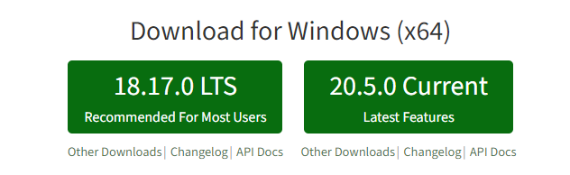
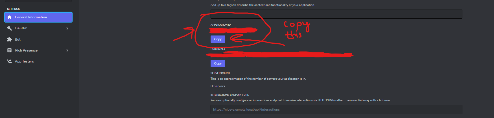

# Discord Image Logger

Hi there

This is a Discord bot designed to log deleted images and send those to a particular channel.

## Features
- Configurable logging channels
- Compatibility with multiple guilds
- No database necessary
- Logs all attached images to a particular channel when the message is deleted
- Doesn't crash on uncaught exceptions

## Intents
Required Priviliged Intents: Server Members (`GUILD_MEMBERS`) **and** Message Content (`MESSAGE_CONTENT`)

## Bugs

Encounter any bugs? Open an issue!

## Disclaimer

I do not accept any responsibility if this code is used for any malicious or unlawful purposes.
## Setup
### Installing NodeJS
First step is to install NodeJS. You can download the latest version from [here](https://nodejs.org/en/download/). Download the LTS version for your operating system.

### Installing the bot
Download the repository. Once downloaded, head to the config.js file. Follow the instructions there to add your configuration data. Once done, open a terminal in the directory and run `npm install`. This will install all the dependencies. 

### Adding the bot to your server
Head to the [Discord Developer Portal](https://discord.com/developers/applications) and create a new application. Once done, head to the 'Bot' tab and click 'Add Bot'. Once done, make a new file in the main folder and name it `.env`. Copy your bot's token. Inside the .env file, write "token=your_discord_token_goes_here", replacing your_discord_token_goes_here with your bot's token which you had copied moments earlier. 

Bot invite link: 	https://discord.com/api/oauth2/authorize?client_id=YOUR_CLIENT_ID&scope=bot&permissions=8 
You can use the above lik to add your bot to your server. Replace YOUR_CLIENT_ID with your bot's client ID. You can find this in the 'General Information' tab of your application in the Discord Developer Portal.

Once done, run `node index.js` to start the bot. You can do this by either clicking and running 'start.bat', or by holding shift+right clicking in the folder and then clicking 'Open PowerShell window here' and then typing `node index.js` to start the process. If you have not installed your dependencies, then the bot will not start. You can install your dependencies by running the command `npm install` in the terminal.

## Support
If anybody needs help with this, feel free to open an issue on GitHub and I will get back to youy as soon as I can. 

## Author

**Discord-Image-Logger** © [Asad Humayun](https://github.com/asadhumayun).

Authored and maintained by Asad.
